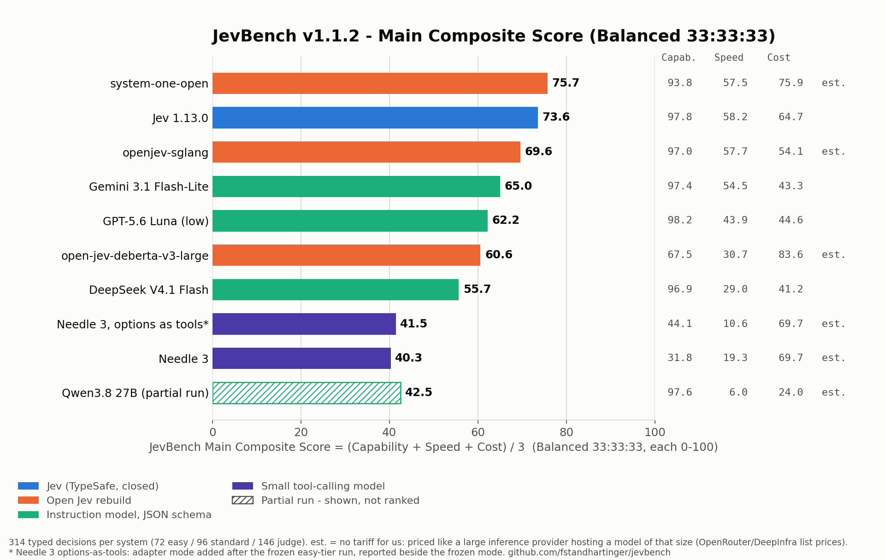

# JevBench

A benchmark for **Jev-class decision models**: you hand the model a piece of state
and a bounded rubric, and it hands back a typed answer, ideally with a probability for
every option. No prose, no parsing, no "as an AI language model".

JevBench is [Benchmark Heaven](https://benchmarkheaven.com)'s own benchmark. It is not
affiliated with or endorsed by TypeSafe AI, whose Jev model is one of the systems
measured here.

## v1.1 (current): three sub-benchmarks and one Main Score

**[Results -> `RESULTS-v1.1.md`](RESULTS-v1.1.md)** · artifact
[`results/v1.1/jevbench-v1.1-results.json`](results/v1.1/jevbench-v1.1-results.json)



| Sub-benchmark | What it measures | Score 0-100 |
|---|---|---|
| **Capability** | accuracy on 314 decisions in three tiers - easy (72, new in v1.1), standard (96), judge (146) | mean of the three tier accuracies |
| **Speed** | median and p95 latency, serial, network included | log scale: 0.1 s = 100, 1 s = 50, 10 s = 0 |
| **Cost** | $ per 1,000 decisions: public tariff x measured tokens, or (no tariff) a labelled estimate at hosted-provider prices for the same weights or size class ([table](results/v1.1/pricing/jevbench-hosted-price-table.json)) | log scale: $0.001 = 100, $0.01 = 75, $0.10 = 50, $1 = 25, $10 = 0 |

**JevBench Main Composite Score = (Capability + Speed + Cost) / 3 - "Balanced 33:33:33"** (v1.1.2).
Three more named weightings are published beside it - *Emphasis on Accuracy (60:20:20)*, the
default until v1.1.1; *Emphasis on Speed (20:60:20)*; *Emphasis on Cost (20:20:60)* - plus
capability-only and a geometric mean. [benchmarkheaven.com/jev-models](https://benchmarkheaven.com/jev-models)
lets you set your own weights. Calibration (Brier, ECE) is reported for
every system with a distribution but is not part of the score - see
[`RESULTS-v1.1.md`](RESULTS-v1.1.md) for why. The rules are pure functions in
[`jevbench/composite.py`](jevbench/composite.py).

The easy tier exists so that small function-calling models are measured, not floored:
clear-cut intent, explicit yes/no facts, enum extraction, one obviously right tool.
48 of its items are public in `datasets/public/easy.jsonl`; 24 are held out.

**Revisions of v1.1 (all 19 Sep 2026; items, answers, Capability and Speed never changed):**
v1.1 (tag `v1.1`) Main Score 60:20:20; v1.1.1 (tag `v1.1.1`) Cost re-priced at hosted-provider
prices for every system without a tariff; **v1.1.2** Main Score weights changed to Balanced 33:33:33
(the previous default is kept as the preset "Emphasis on Accuracy") and the Cost scale widened to
$0.001-$10 per 1,000 decisions, so no system sits at the 100 cap.

v1.1 numbers are never mixed with v1.0's. v1.0 is described below and its results stay in
[`RESULTS.md`](RESULTS.md) as published.

## v1.0

v1.0 scored five axes side by side without a composite: **smart** (is it right), **cheap**
(what 1,000 decisions cost), **fast** (end-to-end latency, network included), **reliable**
(does the stated probability mean anything, does it survive a rephrasing, does it keep to
the schema) and **open** (weights and licence).

## What is in the suite (v1.0; v1.1 adds the easy tier)

242 decisions, six families, three cohorts:

| Cohort | Decisions | Published here? |
|---|---|---|
| `original-public` | 72 (36 paraphrase pairs) | yes, `datasets/public/original.jsonl` |
| `heldout-private` | 24 | no - held back so the suite cannot be trained on in full |
| `imported-public-source` | 146 | no - ground truth is ours, the task text is not ours to redistribute |

Families: request **routing**, answer **adequacy** judging, **policy** yes/no checks,
**intent** classification, **ordinal** severity scoring and enum **extraction**.
Every item states its exact label set; the model answers over that set and nothing else.

The 146 imported decisions come from our own auto-router experiment: 78 routing requests
with human-assigned categories, and 68 answer-adequacy judgements whose ground truth is a
deterministic grader's verdict on a saved answer. See [`THIRD-PARTY.md`](THIRD-PARTY.md).

## How a model is asked

Every system sees the same state, the same instructions, the same rubric and the same
exact label set. Only the transport differs, and each adapter uses the interface the
author published:

| Adapter | For |
|---|---|
| `typesafe` | TypeSafe's `/v1/systemone`, and the open rebuilds that implement the same wire format |
| `systemone_list` | the list-shaped `/decide` flavour some rebuilds ship |
| `gradio_space` | a rebuild whose only public interface is its Hugging Face Space demo |
| `local_openjev` | open weights loaded in-process, no network |
| `openai_compat` | ordinary instruction models, JSON-schema-constrained |

The first four read the model's **own** probability distribution. The last one asks the
model to **write** probabilities out under a schema. Those are different objects and are
labelled `native` and `verbalized` everywhere. Token-level logprobs are not used
anywhere, for anyone.

## Reproduce

Python 3.10+. The HTTP adapters need only the standard library.

```sh
python -m unittest discover -s tests -v

# Jev, the published 72-decision cohort
python -m jevbench.cli run --tasks datasets/public/original.jsonl \
  --adapter typesafe --model jev-latest --key-env TYPESAFE_API_KEY \
  --price-in-per-m 0.042 --price-out-per-m 0 \
  --results RUN/results.jsonl --raw-dir RUN/raw \
  --ledger RUN/ledger.jsonl --cap-usd 15 --manifest RUN/manifest.json

# an open rebuild on its author's public endpoint - note the empty key
python -m jevbench.cli run --tasks datasets/public/original.jsonl \
  --adapter typesafe --endpoint https://SOME-PUBLIC-ENDPOINT --key-env '' \
  --model jev-latest --cost-basis no_billable_account_public_endpoint \
  --reserve-usd 0 --delay-s 0.2 \
  --results RUN2/results.jsonl --raw-dir RUN2/raw --ledger RUN/ledger.jsonl

python -m jevbench.cli summarize --tasks datasets/public/original.jsonl \
  --results RUN/results.jsonl --public-export RUN/summary.json
```

Keys live in the environment and are named, never written into a config file, a result
or a log. `--key-env ''` sends no `Authorization` header at all, which is what a
stranger's public endpoint should get from us.

House rules the harness enforces rather than documents:

- **One budget for everything.** A file-locked ledger reserves the worst-case cost
  *before* a request goes out and settles the real cost after. The cap is shared across
  every run, not granted per model. A crashed run's reservation stays charged.
- **Every run directory is new.** Results and raw responses are created exclusively;
  a rerun can never overwrite paid evidence.
- **Stop means stop.** A 401, 403 or 429, or three consecutive infrastructure errors,
  ends the run. The rest stays unattempted and is reported as unattempted - never as
  answers the model got wrong. There are no retries.
- **No invented numbers.** An unknown price is `null`, not `0`. An empty metric is
  `null` with `n = 0`, not a flattering `0.0`. A malformed distribution is a schema
  failure and counts as wrong; it is never repaired into a distribution.

## What gets measured

- **Accuracy** - argmax over the exact label set. Every block also reports
  `majority_class_accuracy`, the score of always answering with the commonest label,
  because some cohorts are skewed and an accuracy has to be read against its floor.
  95 % confidence intervals resample whole scenarios, since paraphrases of one scenario
  are not independent draws.
- **Valid answers** - a distribution has to cover exactly the label set, sit in [0,1]
  and sum to 1. v1 froze a 0.001 sum tolerance; the run showed that this mostly catches
  three-decimal rounding (0.999 on a nine-option question), so the headline renormalizes
  anything inside a 2 % band and both columns are published: `schema_validity` under that
  rule and `schema_validity_strict` under the frozen one. Outside the band the answer is
  invalid and counts as wrong.
- **Brier** - the multi-class sum `sum_k (p_k - y_k)^2` over the exact label set. Binary
  questions use the matching two-class convention, so the numbers are comparable.
- **ECE** - top-label confidence, 10 equal-width bins. Empty bins are absent, not zero.
  The calibration denominator is reported next to it.
- **Ordinal MAE** - for score questions, the probability-weighted level against the
  reference level, reported beside argmax accuracy rather than instead of it.
- **Paraphrase consistency** - both the same-answer rate and the both-correct rate.
  Agreement alone rewards a model that is consistently wrong.
- **Latency** - caller wall time including the network, one request at a time, no
  concurrency. The first request is reported separately because a scale-to-zero endpoint
  bills its cold start to whoever knocks first.
- **Cost** - measured token usage times the provider's own published tariff, marked
  `derived_usage_times_tariff`. A route with no billable account - a public demo, our own
  CPU, a flat-rate subscription - reports `null` and says which, because unmetered is not
  free.
- **Openness** - code licence, weight availability and weight licence are three separate
  facts, and a permissive repository licence is not a licence for the base model.

## Limits, stated plainly

- 242 decisions is a pilot, not a census. It is English-only, and the original cases are
  short and hand-written.
- The adequacy cohort is 61 `yes` to 7 `no`; its majority-class floor is 82 %. Read that
  family's accuracy against that floor. Some of the judged answers were produced by
  models that also appear as baselines here, so two baselines judge some of their own work.
- The held-out split is sent to the services being evaluated in order to get predictions.
  Not public is not the same as not seen, and this is not a contamination proof.
- Latency comes from one origin (a Hetzner server in Germany) at one time of day. A
  hosted endpoint and a local CPU are not the same kind of latency and should not be
  read as one ranking.
- Public demo endpoints are shared with everyone else using them. Their numbers describe
  that deployment on that day, not the model's ceiling on your hardware.
- Several projects could not be run at all - no GPU, gated weights, Apple-Silicon-only,
  browser-only. They are listed with the concrete reason, and an exclusion is an
  availability fact, never a quality verdict.

## Licence

MIT for this harness and the 72 original public decisions. Everything else - model
weights, other projects' code, upstream datasets - keeps its own licence. See
[`THIRD-PARTY.md`](THIRD-PARTY.md).
