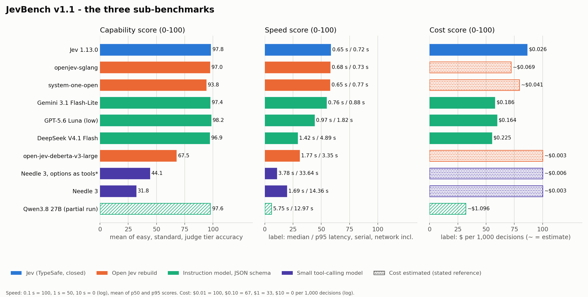
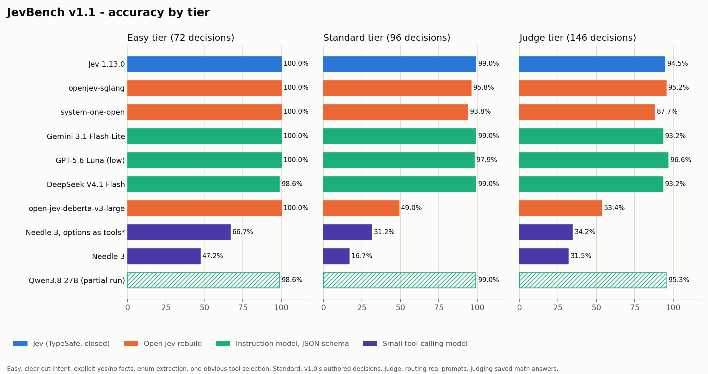
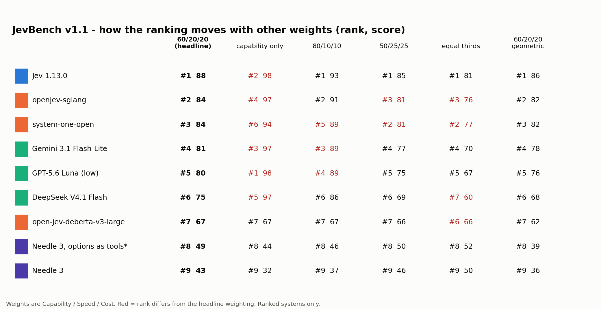

# JevBench v1.1 - results

Generated from `results/v1.1/jevbench-v1.1-results.json` (2026-09-19T08:32 UTC). v1.1 is a new version: it adds an easy tier and scores three sub-benchmarks. Its numbers are not comparable with v1.0's single pooled accuracy ([`RESULTS.md`](RESULTS.md)), which stays as published.

## Main Score

**JevBench Main Score = 0.6 x Capability + 0.2 x Speed + 0.2 x Cost**, each sub-score on 0-100. Capability carries most of the weight because a fast, cheap wrong decision is still wrong. How the ranking moves under five other weightings is in the sensitivity table below.

| # | System | Main | Capability | Speed | Cost | Easy | Standard | Judge | p50 / p95 | $ per 1,000 |
|---|---|---|---|---|---|---|---|---|---|---|
| 1 | Jev 1.13.0 (TypeSafe AI) | **87.6** | 97.8 | 58.2 | 86.2 | 100.0 % | 99.0 % | 94.5 % | 0.65 s / 0.72 s | $0.0259 |
| 2 | openjev-sglang (Qwen3.6-35B-A3B on SGLang) | **84.2** | 97.0 | 57.7 | 72.1 | 100.0 % | 95.8 % | 95.2 % | 0.68 s / 0.73 s | ~$0.0685 |
| 3 | system-one-open (Gemma 4 E2B LoRA on an L4) | **83.7** | 93.8 | 57.5 | 79.5 | 100.0 % | 93.8 % | 87.7 % | 0.65 s / 0.77 s | ~$0.0413 |
| 4 | Gemini 3.1 Flash-Lite | **80.9** | 97.4 | 54.5 | 57.7 | 100.0 % | 99.0 % | 93.2 % | 0.76 s / 0.88 s | $0.1856 |
| 5 | GPT-5.6 Luna (low reasoning effort) | **79.6** | 98.2 | 43.9 | 59.5 | 100.0 % | 97.9 % | 96.6 % | 0.97 s / 1.82 s | $0.1642 |
| 6 | DeepSeek V4.1 Flash (thinking default) | **74.9** | 96.9 | 29.0 | 54.9 | 98.6 % | 99.0 % | 93.2 % | 1.42 s / 4.89 s | $0.2252 |
| 7 | open-jev-deberta-v3-large (local CPU) | **66.6** | 67.5 | 30.7 | 100.0 | 100.0 % | 49.0 % | 53.4 % | 1.77 s / 3.35 s | ~$0.0030 |
| 8 | Needle 3, options as tools (post-hoc adapter mode) | **48.5** | 44.1 | 10.6 | 100.0 | 66.7 % | 31.2 % | 34.2 % | 3.78 s / 33.64 s | ~$0.0061 |
| 9 | Needle 3 (Cactus, 2-bit, local CPU) | **42.9** | 31.8 | 19.3 | 100.0 | 47.2 % | 16.7 % | 31.5 % | 1.69 s / 14.36 s | ~$0.0032 |

`~` = an estimate from a stated reference deployment, because we pay no tariff on that route (see Cost below). Every other price is the provider's public tariff times the tokens we measured.

**Shown, not ranked** (a tier was not attempted in full):

| System | Main | Easy | Standard | Judge | Coverage (easy / standard / judge) | Why |
|---|---|---|---|---|---|---|
| Qwen3.8 27B (Chutes TEE) | 66.2 | 98.6 % | 99.0 % | 95.3 % | 100 % / 100 % / 87 % | v1.0 run stopped at 223 of 242 after three empty completions in a row |
| open-alternative-jev (Qwen3.5-4B, HF Space) | - | - | 33.3 % | - | 0 % / 6 % / 0 % | the author's free Hugging Face Space ran out of ZeroGPU quota after 6 decisions in v1.0, and answered the first v1.1 request on 19 Sep with the same quota error; the next step is a paid Hugging Face subscription, which we did not buy |

## The three sub-benchmarks

- **Capability.** Mean of the three tier accuracies (easy, standard, judge), each weighted 1/3, times 100. Frozen with the v1.1 dataset before any v1.1 inference. Pooled accuracy over all 314 decisions is published beside it.
- **Calibration.** Reported, not scored. Brier and ECE are published for every system that returns a distribution. They are not part of Capability or the Main Score, because label-only systems (Needle 3) have no distribution and any penalty we invented for that would be our choice, not a measurement; and verbalised LLM probabilities and native model distributions are different things.
- **Speed.** Median (p50) and 95th-percentile latency of successful requests in the system's serial run of the 242 standard+judge decisions (one request at a time, from a Hetzner server in Germany, network included; local models on 2 CPU threads of a Ryzen 5 3600). Each latency t maps to 100 * (log10(10 s) - log10(t)) / 2, clipped to 0..100: 0.1 s = 100, 1 s = 50, 10 s = 0. Speed = mean of the p50 and p95 scores. Log scale because 0.2 s vs 0.4 s matters as much as 2 s vs 4 s.
- **Cost.** Dollars per 1,000 decisions over all attempted decisions. Metered APIs: the provider's public tariff times measured tokens. No tariff for us (author endpoints, our CPU, a flat-rate plan): an ESTIMATE, labelled as such, from a stated reference deployment: open weights on a GPU = OpenRouter list price of the same weights (or of the nearest larger sibling) times measured tokens; CPU models = a 2-vCPU Hetzner Cloud CX22 billed for the measured median latency per decision, one decision at a time. Each cost c maps to 100 * (log10($10) - log10(c)) / 3, clipped to 0..100: $0.01 per 1,000 = 100, $0.10 = 67, $1 = 33, $10 = 0.
- **Main.** JevBench Main Score = 0.6 * Capability + 0.2 * Speed + 0.2 * Cost. Capability carries most of the weight because a fast, cheap wrong decision is still wrong. The sensitivity table shows the ranking under five other weightings.
- **Ranked.** Ranked: every tier attempted in full or nearly (>= 95% of decisions). Partial runs are shown, marked, and not ranked.

### Capability by tier

| Tier | Decisions | What it is |
|---|---|---|
| easy | 72 | 72 clear-cut decisions (intent, explicit yes/no fact, enum extraction, one-obvious-tool selection); new in v1.1 |
| judge | 146 | 146 imported decisions from v1.0 (routing real task prompts into 9 categories; judging whether a saved math answer is correct), unchanged |
| standard | 96 | 96 authored decisions from v1.0 (policy, intent, extraction, ordinal, adequacy, routing), unchanged |

The easy tier exists so that the floor of the scale means something. In v1.0 a small tool-calling model scored nothing on the hard routing tasks, and a flat zero would have ranked it level with a system that answers nothing at all. The easy tier asks what small function-calling and extraction models are built for: a clear-cut intent with obvious labels, a yes/no fact stated in the text, an enum named in a short message, the one obviously right tool. Every capable system scores at or near 100 % there; that is the point - the tier separates the bottom of the field, not the top. It was written, reviewed and frozen (hashes in `datasets/manifest.json`) before any v1.1 inference; 48 items are public in `datasets/public/easy.jsonl`, 24 are held out.

### Cost for systems with no tariff

We never write a zero for a route we did not pay for, and we never leave it blank without saying why. The rule:

- **openjev-sglang (Qwen3.6-35B-A3B on SGLang)**: ESTIMATE: qwen/qwen3.6-35b-a3b list price $0.1/M in, $0.9/M out (same base weights (Qwen3.6-35B-A3B)) x 667 input and 2 output tokens per decision.
- **system-one-open (Gemma 4 E2B LoRA on an L4)**: ESTIMATE: google/gemma-4-26b-a4b-it list price $0.09/M in, $0.3/M out (Gemma 4 E2B is not listed; the smallest listed Gemma 4 is larger, so this errs high) x 452 input and 2 output tokens per decision (input tokens counted from the gemini-3.1-flash-lite run, same prompts).
- **open-jev-deberta-v3-large (local CPU)**: ESTIMATE: Hetzner Cloud CX22 (2 vCPU, 4 GB) at $0.0070/h x 1.55 s median per decision, one decision at a time.
- **Needle 3, options as tools (post-hoc adapter mode)**: ESTIMATE: Hetzner Cloud CX22 (2 vCPU, 4 GB) at $0.0070/h x 3.12 s median per decision, one decision at a time.
- **Needle 3 (Cactus, 2-bit, local CPU)**: ESTIMATE: Hetzner Cloud CX22 (2 vCPU, 4 GB) at $0.0070/h x 1.67 s median per decision, one decision at a time.
- **Qwen3.8 27B (Chutes TEE)**: ESTIMATE: qwen/qwen3.8-27b list price $0.214/M in, $2.55/M out (same weights; our run used a flat-rate Chutes subscription) x 445 input and 393 output tokens per decision.

Reference prices: CPU = Hetzner Cloud CX22 (2 vCPU, 4 GB), https://www.hetzner.com/pressroom/new-cx-plans/; tokens = https://openrouter.ai/api/v1/models (read 2026-09-19).

### Calibration (reported, not scored)

| System | Brier (standard + judge) | Distribution |
|---|---|---|
| Jev 1.13.0 (TypeSafe AI) | 0.056 | native |
| openjev-sglang (Qwen3.6-35B-A3B on SGLang) | 0.085 | native |
| system-one-open (Gemma 4 E2B LoRA on an L4) | 0.138 | native |
| Gemini 3.1 Flash-Lite | 0.095 | verbalized |
| GPT-5.6 Luna (low reasoning effort) | 0.056 | verbalized |
| DeepSeek V4.1 Flash (thinking default) | 0.028 | verbalized |
| open-jev-deberta-v3-large (local CPU) | 0.651 | native |
| Needle 3, options as tools (post-hoc adapter mode) | - | label_only_no_calibrated_distribution |
| Needle 3 (Cactus, 2-bit, local CPU) | - | label_only_no_calibrated_distribution |
| Qwen3.8 27B (Chutes TEE) | 0.019 | verbalized |
| open-alternative-jev (Qwen3.5-4B, HF Space) | 1.001 | native |

## Sensitivity: the ranking under other weights

| System | 60/20/20 (headline) | capability only | 80/10/10 | 50/25/25 | equal thirds | 60/20/20 geometric |
|---|---|---|---|---|---|---|
| Jev 1.13.0 (TypeSafe AI) | #1 (87.6) | #2 (97.8) | #1 (92.7) | #1 (85.0) | #1 (80.7) | #1 (86.0) |
| openjev-sglang (Qwen3.6-35B-A3B on SGLang) | #2 (84.2) | #4 (97.0) | #2 (90.6) | #3 (81.0) | #3 (75.6) | #2 (82.4) |
| system-one-open (Gemma 4 E2B LoRA on an L4) | #3 (83.7) | #6 (93.8) | #5 (88.7) | #2 (81.1) | #2 (76.9) | #3 (82.3) |
| Gemini 3.1 Flash-Lite | #4 (80.9) | #3 (97.4) | #3 (89.1) | #4 (76.7) | #4 (69.9) | #4 (78.1) |
| GPT-5.6 Luna (low reasoning effort) | #5 (79.6) | #1 (98.2) | #4 (88.9) | #5 (74.9) | #5 (67.2) | #5 (75.6) |
| DeepSeek V4.1 Flash (thinking default) | #6 (74.9) | #5 (96.9) | #6 (85.9) | #6 (69.4) | #7 (60.3) | #6 (68.0) |
| open-jev-deberta-v3-large (local CPU) | #7 (66.6) | #7 (67.5) | #7 (67.0) | #7 (66.4) | #6 (66.1) | #7 (62.3) |
| Needle 3, options as tools (post-hoc adapter mode) | #8 (48.5) | #8 (44.1) | #8 (46.3) | #8 (49.7) | #8 (51.5) | #8 (39.0) |
| Needle 3 (Cactus, 2-bit, local CPU) | #9 (42.9) | #9 (31.8) | #9 (37.4) | #9 (45.7) | #9 (50.4) | #9 (36.2) |

Jev 1.13.0 is first under every weighting except *capability only*, where GPT-5.6 Luna leads by 0.4 points - inside the noise we measured when Jev answered the same suite twice. The two Needle 3 rows are last under every weighting, and above zero under every weighting.

## Needle 3

Needle 3 (Cactus Compute, 121M parameters, 2-bit, local CPU) is a function-calling model, not a Jev-class decision model: it returns a tool call (a label), not a probability distribution over the label set, so it has no Brier or ECE and we do not manufacture one from its single confidence scalar. The adapter asks it the way it is built to be asked: one tool whose one argument is the typed answer - an enum for choices, a boolean for yes/no, an integer enum for levels. When Needle declines to call the tool (its "the request does not fit the tool" refusal), the decision counts as wrong; what the suppressed call would have said is kept in the raw record.

After the frozen easy-tier run showed Needle declining the one-tool form for requests like "Where is my package?" (no tool could *serve* the request), we added a second adapter mode: every option becomes its own tool, and the tool it calls is the answer - Needle's native tool-selection use. It is reported **beside** the frozen mode, never instead of it, and marked with an asterisk wherever it appears. Judge-tier items are all yes/no, which this mode does not change, so they are shared with the frozen run rather than re-run. For about four minutes of this mode's 174-decision run our own video rendering shared the server's CPU, so its latency (and with it its Speed score) may be slightly pessimistic; the frozen-mode run had the CPU to itself.

## Reproduce

`jevbench/composite.py` holds the scoring rules as pure functions (tested in `tests/test_composite.py`); the artifact carries every input they need, so any Main Score in this file can be recomputed from the JSON.

